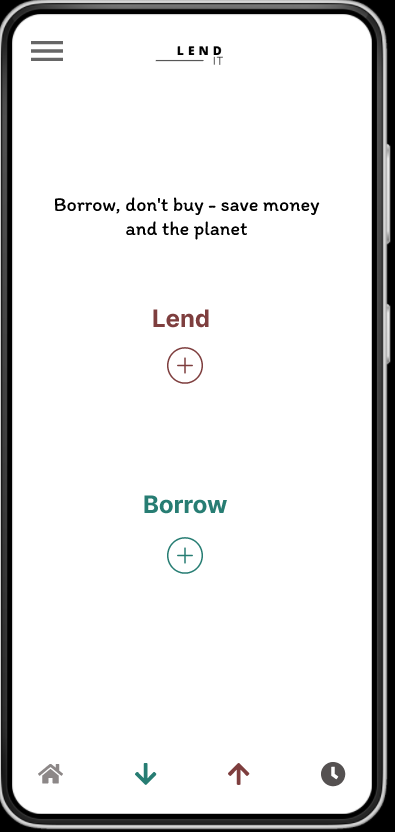

# where-is-my-stuff

**"Where's My Stuff"** is a mobile app designed to help users keep track of items they have borrowed or lent out. The app self name `LendLog` and it provides an easy-to-use interface for users to input and manage their inventory of items, and includes features like proof of delivery and proof of return to help ensure that items are returned on time. Our team is focused on developing the front-end user interface of the app, with a clean and intuitive design that makes it simple for users to manage their borrowed items on the go.

## Screenshots

%201.png)

## Table of Contents

- [where-is-my-stuff](#where-is-my-stuff)
  - [Screenshots](#screenshots)
  - [Table of Contents](#table-of-contents)
    - [Installation](#installation)
    - [Usage](#usage)
    - [Features](#features)
    - [Contributing](#contributing)
      - [1. Bug reports and feature requests](#1-bug-reports-and-feature-requests)
      - [2. Code guidelines](#2-code-guidelines)
      - [3. Getting started](#3-getting-started)
      - [4. Code review](#4-code-review)
    - [License](#license)

### Installation

- Clone the [where-is-my-stuff-frontend](https://github.com/HYF-Class19/where-is-my-stuff-frontend.git) from GitHub to your local machine.
- Open the project in your preferred development environment such as VsCode.
- Install any necessary dependencies using a package manager like npm.
- Start the development server and launch the app in your web browser to begin testing and development.
- Open your web browser and navigate to [http://localhost:3000](http://localhost:3000) to view the app.
- Remember! Always create a new branch when making changes in your local machine.
- Once you've made changes to the code, commit and push your changes to the GitHub repository to keep the project up to date.
- After pushing the changes always create a pull requests and assign to yourself, and then assign who is going to review your changes.

### Usage

The app is still in development and not yet ready, when app fully developed, we will add later the section usage to know how to use it.

### Features

- Ability to create and manage an inventory of items that have been lent.
- Option to add a description or notes for each item in the inventory.
- Ability to track the status of each item (e.g. lent out, returned, etc.).
- Proof of delivery and proof of return functionality for each item.
- Search and filter capabilities for the inventory.
<!-- - User authentication and security features. -->
- Mobile-responsive design for easy use on any device

### Contributing

As group of **Where's My Stuff** developer we welcome anyone who is interested in helping to improve the app. Here are some guidelines to follow when contributing:-

#### 1. Bug reports and feature requests

If you encounter a bug or have an idea for a new feature, please submit an issue on our GitHub repository. When submitting an issue, please provide as much detail as possible, including steps to reproduce the issue and any relevant screenshots or error messages.

#### 2. Code guidelines

When submitting code changes, please add here to the following guidelines:

- Follow the coding style and conventions used in the existing Code Base.
- Write clear, concise, and well-documented code.
- Use descriptive commit messages that summarize your changes.

#### 3. Getting started

To get started contributing to **Where's My Stuff Front-end**, follow these steps:

- Fork the repository on GitHub, for those who are not team member.
- Clone your forked repository to your local machine, for new contributers and clone without fork for those who team member.
- Set up a development environment and install any necessary dependencies.
- Push your changes to your forked repository.
- Submit a pull request to the main repository.

#### 4. Code review

All code changes will be reviewed by members of the development team. Please be patient while waiting for your changes to be reviewed, and be open to feedback and suggestions for improvement.

Thank you for your interest in contributing to Where's My Stuff PROJECT!

### License

GNU General Public License (GPL): This is a copy left license that requires anyone who distributes the software or derivative works to make the source code available under the same license terms. This ensures that the software remains free and open source.
