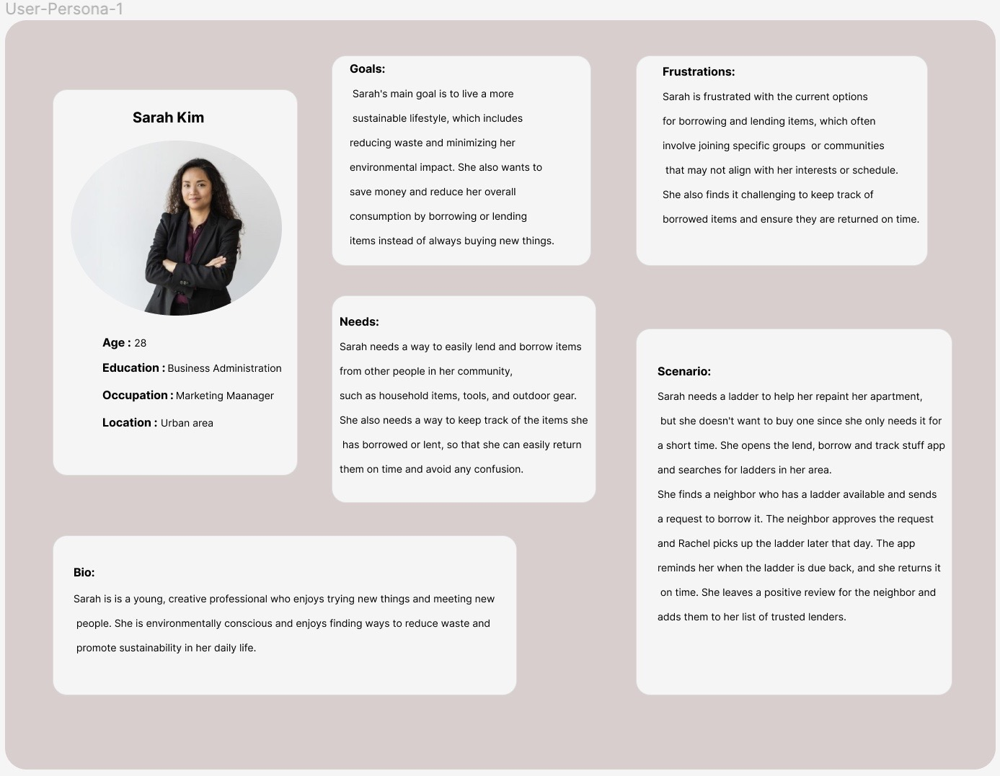

# User-persona

The user persona for our "Where's My Stuff" or **LendLog** app is a busy two individuals who frequently borrows items from friends and lends items to others. These two individual needs a way to easily keep track of what they have borrowed or lent out, who they borrowed or lent it to, and when it needs to be returned. they also wants a way to quickly communicate with the borrower or lender if needed. These individual's frustration scenario is losing track of borrowed or lent items and not being able to locate them in time when they are needed.

